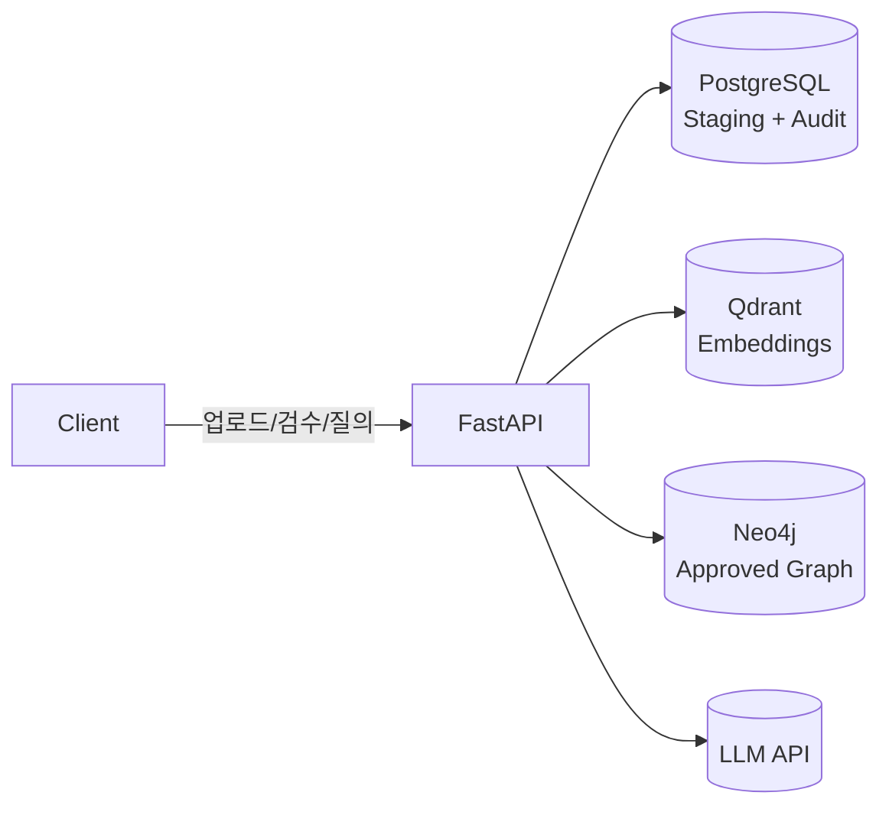
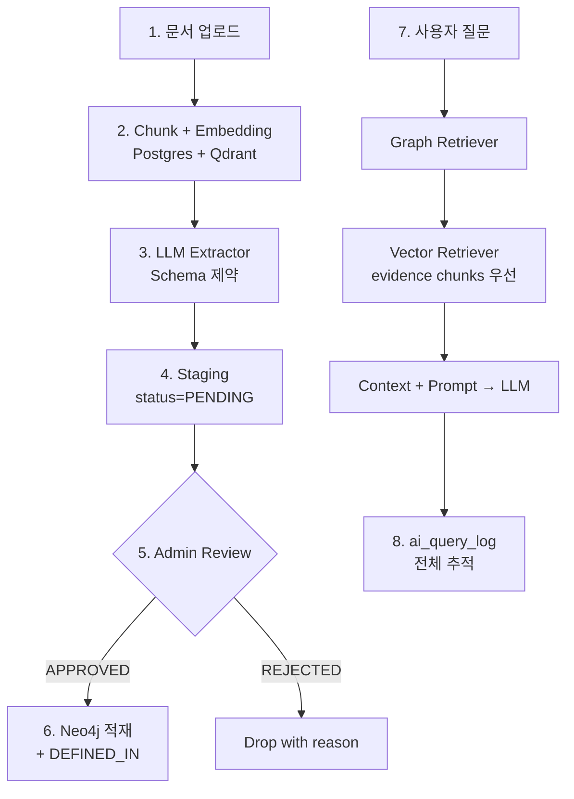

# Ontology-Grounded RAG Governance Platform (MVP)

> 원문 문서에서 엔티티/관계 후보를 추출하고, 도메인 전문가가 검수·승인한 지식만 Graph DB에 적재한 뒤,
> 질문 시 관련 Subgraph와 문서 Chunk를 함께 찾아 LLM 프롬프트를 증강하는 **GraphRAG + AI Governance** 플랫폼.

**한 줄 포지셔닝** — Enterprise AI Platform Backend with Ontology / Knowledge Graph / GraphRAG / AI Governance.

---

## 왜 이 프로젝트인가

기존 Vector RAG는 문서 유사도 검색에는 강하지만, 도메인 개념 간 **관계 / 규칙 / 정책 / 상태 판단**에 약합니다. 그래서:

- 주문은 결제와 어떤 관계인가
- 환불은 어떤 조건에서 가능한가
- 특정 정책은 어떤 엔티티에 적용되는가
- 이 답변의 **근거 원문**은 무엇이고 **누가 승인**한 지식인가

이 MVP는 위 질문에 답하기 위해 **Vector + Graph + Staging-Review + Audit** 구조를 한 번 끝까지 구현한 학습/포트폴리오 프로젝트입니다.

## 기술 스택

| Layer | 선택 | 비고 |
|---|---|---|
| Backend | **FastAPI** (Python 3.12) | v2는 Spring Boot/JPA로 이식 가능한 모듈 경계 |
| RDB | PostgreSQL 16 | 문서 / Chunk / Staging / Audit / Sync Log |
| Graph DB | Neo4j 5 + APOC | 승인된 Ontology Instance |
| Vector DB | Qdrant | Chunk Embedding (384-dim, Cosine) |
| LLM | OpenAI / Anthropic / **Fake** | Gateway 추상화. Fake provider로 API 키 없이 E2E |
| Infra | Docker Compose | local-first |

## 아키텍처



데이터 흐름:



> 자세한 컴포넌트/모듈 책임은 [docs/01-architecture.md](docs/01-architecture.md).

## 핵심 설계 원칙 (불변)

1. LLM 추출 결과는 Graph DB에 **바로 들어가지 않는다** — 무조건 Staging Table 경유.
2. 도메인 전문가가 **APPROVED** 한 지식만 Neo4j에 적재된다.
3. 모든 Graph Node/Relation은 **원문 Chunk와 `DEFINED_IN`**으로 연결된다.
4. Relation 승인은 source/target 양쪽이 모두 APPROVED일 때만 가능하다.
5. 질문 시 전체 온톨로지가 아니라 **관련 Subgraph만** LLM에 들어간다.
6. Vector DB = **근거 검색용**, Graph DB = **개념·관계 탐색용** (역할 분리).
7. 모든 질문/검색 결과/Prompt/답변은 `ai_query_log`에 영속화된다.

위 7개 invariant는 `tests/unit/test_*invariant*.py` 와 `test_relation_approval_policy.py` 로 회귀 보호됩니다.

## MVP 도메인

이커머스 **주문 / 결제 / 환불 / 정책** 도메인.

- **Entity Type** (9종): `Order`, `OrderItem`, `Product`, `Payment`, `Refund`, `Delivery`, `Policy`, `Condition`, `DocumentChunk`
- **Relation Type** (6종): `Order CONTAINS OrderItem`, `Order PAID_BY Payment`, `Refund REFUNDS Payment`, `Policy APPLIES_TO Order`, `Policy REQUIRES Condition`, `Policy DEFINED_IN DocumentChunk`

---

## Quickstart

```bash
cp .env.example .env
docker compose up --build -d
docker compose exec app alembic upgrade head
docker compose exec app python -m app.seeds.ontology_seed
docker compose exec app python -m app.seeds.prompt_seed
curl http://localhost:8000/health
```

4개 컨테이너가 모두 healthy면 `/health` 가 `{"status":"ok", ...}` 를 반환합니다. 특정 서비스가 죽어도 앱은 살아 있고 어떤 서비스가 `down` 인지 알려줍니다.

### 60초 데모

```bash
# 1) 문서 등록
DOC=$(curl -sX POST http://localhost:8000/documents \
  -H 'Content-Type: application/json' \
  -d '{"title":"환불 정책 v1","domain":"order","source_type":"policy","version":"v1","access_level":"internal",
       "content":"결제 완료 후 배송 시작 전에는 주문 전체 취소가 가능하다. 부분 취소는 주문상품 단위로만 가능하다. 환불 금액은 실제 결제 금액을 초과할 수 없다."}' \
  | python -c "import json,sys;print(json.load(sys.stdin)['document_id'])")

# 2) LLM 추출 (Fake provider 기본 — API 키 불필요)
curl -X POST http://localhost:8000/documents/$DOC/extract
```

이후 검수 / Graph Sync / QA / Audit 시나리오 전체는 **[docs/USAGE.md](docs/USAGE.md)** 에 있습니다.

## 접속 정보

| 서비스 | URL | 비고 |
|---|---|---|
| FastAPI | http://localhost:8000 | `/docs` 자동 OpenAPI |
| Neo4j Browser | http://localhost:7474 | `neo4j` / `password` |
| Qdrant | http://localhost:6333 | `/dashboard` |
| Postgres | localhost:5432 | `ontology_user` / `ontology_password` |

## 개발

```bash
pip install -r requirements.txt
pytest                # 58 tests
ruff check . && ruff format --check .
mypy app
```

품질 게이트 (현재 그린):

| 도구 | 결과 |
|---|---|
| pytest | 58 passed |
| ruff check | All checks passed |
| ruff format | clean |
| mypy | Success: no issues found in 86 source files |

## 문서 구성

| 문서 | 내용 |
|---|---|
| [docs/USAGE.md](docs/USAGE.md) | **E2E 사용 가이드** — 문서 등록 → 추출 → 검수 → Sync → QA → Audit |
| [docs/01-architecture.md](docs/01-architecture.md) | 전체 아키텍처 & 데이터 흐름 (Mermaid) |
| [docs/02-domain-model.md](docs/02-domain-model.md) | 도메인 모델 & 상태 전이 |
| [docs/03-database-schema.md](docs/03-database-schema.md) | PostgreSQL 설계 (구현된 DDL은 `alembic/versions/`) |
| [docs/04-graph-model.md](docs/04-graph-model.md) | Neo4j 그래프 모델 + Cypher |
| [docs/05-api-spec.md](docs/05-api-spec.md) | REST API 설계 (실제 라우터는 `app/api/routes/`) |
| [docs/06-admin-ui.md](docs/06-admin-ui.md) | Admin UI 화면 설계 (미구현, v2 후보) |
| [docs/07-query-sequence.md](docs/07-query-sequence.md) | GraphRAG 질의 시퀀스 |
| [docs/08-roadmap.md](docs/08-roadmap.md) | 4주 개발 로드맵 |
| [docs/09-out-of-scope.md](docs/09-out-of-scope.md) | MVP 제외 항목 |
| [docs/10-portfolio.md](docs/10-portfolio.md) | 포트폴리오 메시지 |
| [docs/11-implementation-plan.md](docs/11-implementation-plan.md) | 구현 전략 + 체크리스트 + DoD |

## 현재 상태 (2026-05-19)

W0~W4 + 리팩토링 완료. main 브랜치에 머지·푸시됨. 다음 후보:

1. 실제로 한 번 돌려보고 발견된 이슈 처리 ← **현재 위치**
2. CI 추가 (`.github/workflows/ci.yml`)
3. 실 LLM 키 happy path 1회 검증
4. Admin UI (React) — 포트폴리오 임팩트
