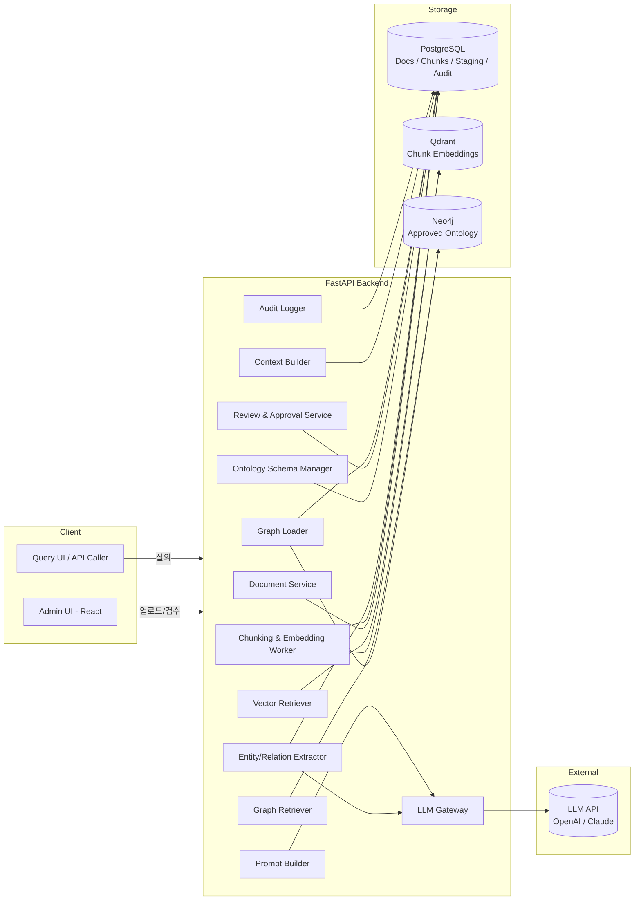
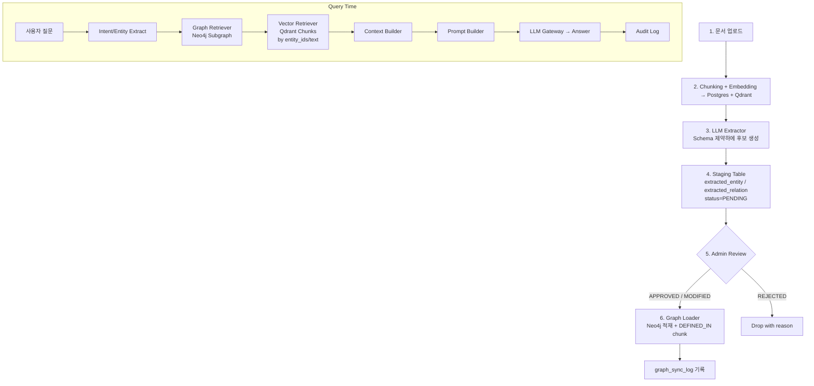

# 1. MVP 전체 아키텍처

## 1.1 시스템 컴포넌트 다이어그램

## 1.2 데이터 흐름 (Ingestion → Approval → Query)

## 1.3 Vector DB vs Graph DB 역할 분리

| 항목 | Vector DB (Qdrant) | Graph DB (Neo4j) |
|---|---|---|
| 저장 단위 | Document Chunk + Embedding | Entity Node + Relation Edge |
| 검색 방식 | Semantic similarity (kNN) | Pattern / Path / Cypher |
| 1차 키 | `chunk_id` | `entity_id`, `normalized_name` |
| 책임 | **무엇이 적혀있나** (근거) | **무엇과 어떻게 연결되나** (규칙/관계) |
| 사용 위치 | Vector Retriever | Graph Retriever |
| 변경 주기 | 문서 업로드 시 즉시 | 검수 승인 후에만 |

핵심: **Graph가 먼저 Subgraph를 찾고**, 그 Subgraph가 가리키는 `DEFINED_IN` chunk_id 또는 추출된 entity 텍스트로 **Vector가 원문 근거를 보강**합니다.

## 1.4 모듈 책임 (1~12)

| # | 모듈 | 책임 | 주요 의존성 |
|---|---|---|---|
| 1 | Document Management | 업로드/버전/메타 | Postgres |
| 2 | Chunking & Embedding Worker | Chunk 분할, embedding, Qdrant 적재 | Postgres, Qdrant, Embedding API |
| 3 | Entity/Relation Extractor | Schema 제약 기반 LLM 호출, 후보 생성 | LLM Gateway, Postgres |
| 4 | Ontology Schema Manager | Entity/Relation Type, 허용 관계 정의 | Postgres |
| 5 | Review & Approval Admin | 후보 검수, 승인/반려/수정/병합 | Postgres |
| 6 | Graph DB Loader | 승인 결과 Neo4j 적재, sync_log | Postgres, Neo4j |
| 7 | Graph Retriever | Cypher 기반 Subgraph 탐색 | Neo4j |
| 8 | Vector Retriever | Chunk kNN, entity 기반 필터 | Qdrant |
| 9 | Context Builder | Graph + Chunk → 정규화된 컨텍스트 | - |
| 10 | Prompt Builder | template + 버전관리, slot 채우기 | Postgres (prompt_template) |
| 11 | LLM Gateway | provider 추상화, retry/timeout | OpenAI / Claude |
| 12 | Audit Logger | 질의/검색/프롬프트/답변 영속화 | Postgres |

## 1.5 비기능 요구 (MVP 한정)

- **단일 노드 로컬 환경** (Docker Compose)
- 인증: 단일 admin user (JWT 없음, 헤더 `X-Admin-Token`)
- 동시성: 큐 대신 FastAPI BackgroundTasks
- 비용 제어: extractor 호출 시 chunk 수 상한, LLM token budget 로그
