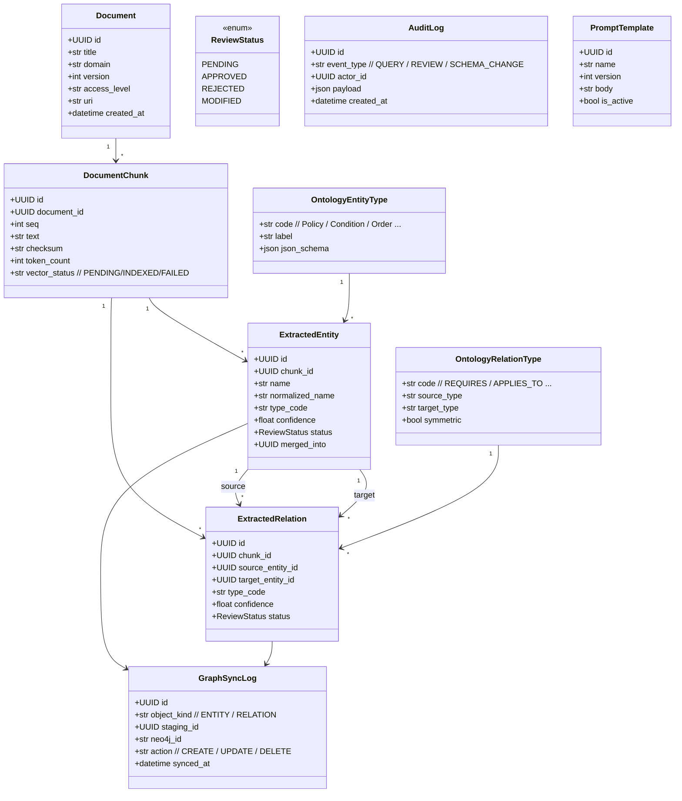
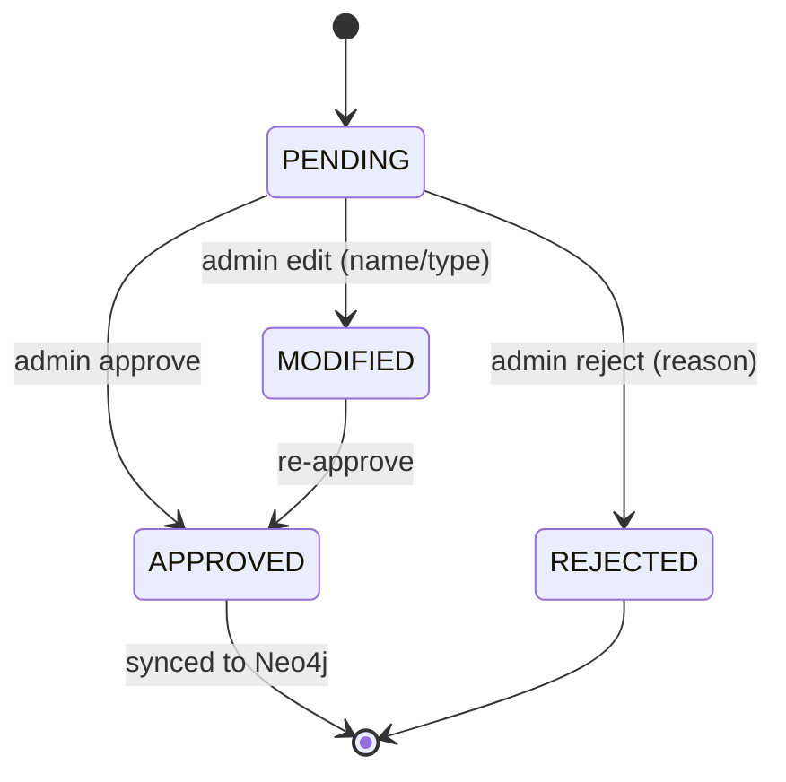

# 2. 도메인 모델 설계

## 2.1 개요 (Class diagram)

## 2.2 핵심 불변식 (Invariants)

1. `ExtractedRelation`은 두 `ExtractedEntity`(source, target)가 모두 `APPROVED` 상태여야 `APPROVED` 가능.
2. `(source_type, type_code, target_type)` 조합은 반드시 `OntologyRelationType`에 존재해야 한다. 위반 시 LLM 출력은 자동 `REJECTED`.
3. 모든 `APPROVED` Entity/Relation은 `GraphSyncLog`에 1건 이상 기록되어야 한다.
4. `normalized_name`은 같은 `type_code` 내에서 unique. 중복 시 admin이 **merge** 액션으로 병합 (`merged_into` 세팅).
5. `DocumentChunk.checksum` 변경 시 해당 chunk에서 파생된 staging 엔트리는 invalidate.

## 2.3 ReviewStatus 전이도

## 2.4 정규화 규칙 (normalized_name)

- 한글/영문 혼용 명사 → snake/Pascal 변환 후 영문 우선
  - "전체 취소 정책" → `FullCancelPolicy`
  - "결제 완료" → `PaymentCompleted`
- Extractor가 1차 제안, admin이 수정 시 audit 기록.

## 2.5 Ontology Seed (이커머스 도메인)

| Entity Type | 설명 |
|---|---|
| Order | 주문 |
| OrderItem | 주문 상품 |
| Product | 상품 |
| Payment | 결제 |
| Refund | 환불 |
| Delivery | 배송 |
| Policy | 정책 |
| Condition | 조건 |

| Relation | Source → Target |
|---|---|
| CONTAINS | Order → OrderItem |
| PAID_BY | Order → Payment |
| REFUNDS | Refund → Payment |
| APPLIES_TO | Policy → Order \| Refund \| Payment |
| REQUIRES | Policy → Condition |
| DEFINED_IN | * → DocumentChunk (자동) |
