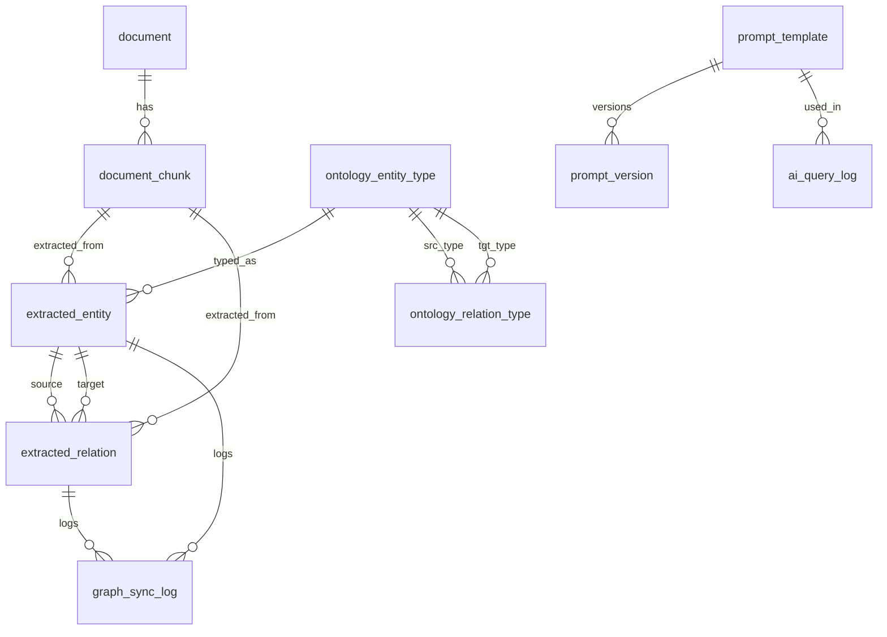

# 3. PostgreSQL DB 테이블 설계

> 모든 테이블은 `id UUID PRIMARY KEY DEFAULT gen_random_uuid()`, `created_at/updated_at TIMESTAMPTZ` 공통.
> 외래키는 `ON DELETE RESTRICT` 기본, staging→document만 `ON DELETE CASCADE`.

## 3.1 ENUM 타입

```sql
CREATE TYPE review_status AS ENUM ('PENDING', 'APPROVED', 'REJECTED', 'MODIFIED');
CREATE TYPE vector_status AS ENUM ('PENDING', 'INDEXED', 'FAILED');
CREATE TYPE sync_action  AS ENUM ('CREATE', 'UPDATE', 'DELETE');
CREATE TYPE object_kind  AS ENUM ('ENTITY', 'RELATION');
```

## 3.2 document

```sql
CREATE TABLE document (
  id            UUID PRIMARY KEY DEFAULT gen_random_uuid(),
  title         TEXT NOT NULL,
  domain        TEXT NOT NULL,                -- e.g. 'ecommerce'
  version       INT  NOT NULL DEFAULT 1,
  access_level  TEXT NOT NULL DEFAULT 'INTERNAL',
  uri           TEXT,                          -- 원문 저장 위치
  meta          JSONB NOT NULL DEFAULT '{}',
  created_at    TIMESTAMPTZ NOT NULL DEFAULT now(),
  updated_at    TIMESTAMPTZ NOT NULL DEFAULT now(),
  UNIQUE (title, version)
);
CREATE INDEX idx_document_domain ON document(domain);
```

## 3.3 document_chunk

```sql
CREATE TABLE document_chunk (
  id            UUID PRIMARY KEY DEFAULT gen_random_uuid(),
  document_id   UUID NOT NULL REFERENCES document(id) ON DELETE CASCADE,
  seq           INT  NOT NULL,
  text          TEXT NOT NULL,
  checksum      TEXT NOT NULL,                  -- sha256(text)
  token_count   INT,
  vector_status vector_status NOT NULL DEFAULT 'PENDING',
  vector_ref    TEXT,                            -- Qdrant point id
  created_at    TIMESTAMPTZ NOT NULL DEFAULT now(),
  UNIQUE (document_id, seq)
);
CREATE INDEX idx_chunk_doc ON document_chunk(document_id);
CREATE INDEX idx_chunk_status ON document_chunk(vector_status);
```

## 3.4 ontology_entity_type

```sql
CREATE TABLE ontology_entity_type (
  code         TEXT PRIMARY KEY,                 -- 'Policy'
  label        TEXT NOT NULL,
  description  TEXT,
  json_schema  JSONB NOT NULL DEFAULT '{}',
  is_active    BOOLEAN NOT NULL DEFAULT TRUE,
  created_at   TIMESTAMPTZ NOT NULL DEFAULT now()
);
```

## 3.5 ontology_relation_type

```sql
CREATE TABLE ontology_relation_type (
  code          TEXT NOT NULL,                   -- 'REQUIRES'
  source_type   TEXT NOT NULL REFERENCES ontology_entity_type(code),
  target_type   TEXT NOT NULL REFERENCES ontology_entity_type(code),
  symmetric     BOOLEAN NOT NULL DEFAULT FALSE,
  description   TEXT,
  is_active     BOOLEAN NOT NULL DEFAULT TRUE,
  PRIMARY KEY (code, source_type, target_type)
);
```

> Extractor는 이 테이블의 활성 row를 system prompt에 주입하여 LLM의 출력 schema를 제약합니다.

## 3.6 extracted_entity (Staging)

```sql
CREATE TABLE extracted_entity (
  id               UUID PRIMARY KEY DEFAULT gen_random_uuid(),
  document_id      UUID NOT NULL REFERENCES document(id) ON DELETE CASCADE,
  chunk_id         UUID NOT NULL REFERENCES document_chunk(id) ON DELETE CASCADE,
  name             TEXT NOT NULL,                 -- 원문 표기
  normalized_name  TEXT NOT NULL,                 -- 정규화
  type_code        TEXT NOT NULL REFERENCES ontology_entity_type(code),
  confidence       NUMERIC(4,3) NOT NULL,
  status           review_status NOT NULL DEFAULT 'PENDING',
  reviewed_by      TEXT,
  reviewed_at      TIMESTAMPTZ,
  rejection_reason TEXT,
  merged_into      UUID REFERENCES extracted_entity(id),
  payload          JSONB NOT NULL DEFAULT '{}',   -- LLM 원본 응답 보존
  created_at       TIMESTAMPTZ NOT NULL DEFAULT now()
);
CREATE INDEX idx_ee_status ON extracted_entity(status);
CREATE UNIQUE INDEX uq_ee_norm_type_approved
  ON extracted_entity(normalized_name, type_code)
  WHERE status = 'APPROVED' AND merged_into IS NULL;
```

## 3.7 extracted_relation (Staging)

```sql
CREATE TABLE extracted_relation (
  id                UUID PRIMARY KEY DEFAULT gen_random_uuid(),
  document_id       UUID NOT NULL REFERENCES document(id) ON DELETE CASCADE,
  chunk_id          UUID NOT NULL REFERENCES document_chunk(id) ON DELETE CASCADE,
  source_entity_id  UUID NOT NULL REFERENCES extracted_entity(id),
  target_entity_id  UUID NOT NULL REFERENCES extracted_entity(id),
  type_code         TEXT NOT NULL,                -- FK는 (code, src, tgt) 복합이라 트리거로 검증
  confidence        NUMERIC(4,3) NOT NULL,
  status            review_status NOT NULL DEFAULT 'PENDING',
  reviewed_by       TEXT,
  reviewed_at       TIMESTAMPTZ,
  rejection_reason  TEXT,
  created_at        TIMESTAMPTZ NOT NULL DEFAULT now()
);
CREATE INDEX idx_er_status ON extracted_relation(status);
```

**Schema 일관성 트리거** (의사 코드):

```sql
CREATE OR REPLACE FUNCTION fn_validate_relation_schema() RETURNS trigger AS $$
DECLARE src_t TEXT; tgt_t TEXT;
BEGIN
  SELECT type_code INTO src_t FROM extracted_entity WHERE id = NEW.source_entity_id;
  SELECT type_code INTO tgt_t FROM extracted_entity WHERE id = NEW.target_entity_id;
  IF NOT EXISTS (
    SELECT 1 FROM ontology_relation_type
    WHERE code = NEW.type_code AND source_type = src_t AND target_type = tgt_t AND is_active
  ) THEN
    RAISE EXCEPTION 'Relation % not allowed for % -> %', NEW.type_code, src_t, tgt_t;
  END IF;
  RETURN NEW;
END $$ LANGUAGE plpgsql;
```

## 3.8 graph_sync_log

```sql
CREATE TABLE graph_sync_log (
  id           UUID PRIMARY KEY DEFAULT gen_random_uuid(),
  object_kind  object_kind NOT NULL,
  staging_id   UUID NOT NULL,
  neo4j_id     TEXT,
  action       sync_action NOT NULL,
  payload      JSONB NOT NULL DEFAULT '{}',
  synced_at    TIMESTAMPTZ NOT NULL DEFAULT now()
);
CREATE INDEX idx_sync_staging ON graph_sync_log(object_kind, staging_id);
```

## 3.9 ai_query_log (= Audit Log for query)

```sql
CREATE TABLE ai_query_log (
  id                 UUID PRIMARY KEY DEFAULT gen_random_uuid(),
  question           TEXT NOT NULL,
  intent             JSONB NOT NULL DEFAULT '{}', -- 추출된 entity/intent
  graph_context      JSONB NOT NULL DEFAULT '{}', -- 검색된 subgraph
  vector_context     JSONB NOT NULL DEFAULT '{}', -- 사용된 chunk_id list
  prompt_template_id UUID REFERENCES prompt_template(id),
  rendered_prompt    TEXT NOT NULL,
  answer             TEXT NOT NULL,
  llm_provider       TEXT NOT NULL,
  llm_model          TEXT NOT NULL,
  latency_ms         INT,
  token_input        INT,
  token_output       INT,
  actor_id           TEXT,
  created_at         TIMESTAMPTZ NOT NULL DEFAULT now()
);
CREATE INDEX idx_qlog_actor ON ai_query_log(actor_id);
CREATE INDEX idx_qlog_created ON ai_query_log(created_at);
```

## 3.10 prompt_template / prompt_version

```sql
CREATE TABLE prompt_template (
  id          UUID PRIMARY KEY DEFAULT gen_random_uuid(),
  name        TEXT NOT NULL UNIQUE,
  description TEXT,
  is_active   BOOLEAN NOT NULL DEFAULT TRUE,
  created_at  TIMESTAMPTZ NOT NULL DEFAULT now()
);

CREATE TABLE prompt_version (
  id            UUID PRIMARY KEY DEFAULT gen_random_uuid(),
  template_id   UUID NOT NULL REFERENCES prompt_template(id) ON DELETE CASCADE,
  version       INT  NOT NULL,
  body          TEXT NOT NULL,             -- jinja2 style placeholders
  variables     JSONB NOT NULL DEFAULT '{}',
  is_active     BOOLEAN NOT NULL DEFAULT FALSE,
  created_at    TIMESTAMPTZ NOT NULL DEFAULT now(),
  UNIQUE (template_id, version)
);
CREATE UNIQUE INDEX uq_prompt_active
  ON prompt_version(template_id) WHERE is_active = TRUE;
```

## 3.11 audit_log (범용)

```sql
CREATE TABLE audit_log (
  id          UUID PRIMARY KEY DEFAULT gen_random_uuid(),
  event_type  TEXT NOT NULL,         -- REVIEW_APPROVE / SCHEMA_CHANGE / DOC_UPLOAD ...
  actor_id    TEXT,
  payload     JSONB NOT NULL DEFAULT '{}',
  created_at  TIMESTAMPTZ NOT NULL DEFAULT now()
);
CREATE INDEX idx_audit_event ON audit_log(event_type, created_at DESC);
```

## 3.12 ER 다이어그램


