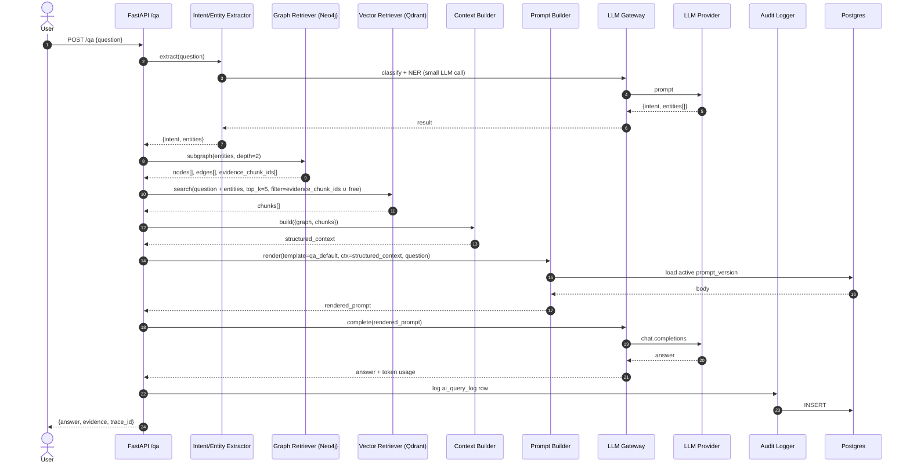

# 7. 질문 응답 시퀀스

## 7.1 Sequence Diagram



## 7.2 단계별 상세

### Step 1. Intent / Entity 추출
- 입력: 자연어 질문
- 출력: `{ intent: "policy_check|fact_lookup|...", entities: [{name, type_code?}] }`
- 비용 절감을 위해 작은 모델 사용 가능 (Haiku급)

### Step 2. Graph Retriever
- 시드: 추출 entity의 `normalized_name` (없으면 fuzzy)
- 전략: BFS up to `graph_depth`, 단 허용 relation type만
- 출력: `{nodes, edges, evidence_chunk_ids}` (각 노드/엣지의 `DEFINED_IN` → chunk_id 수집)

```cypher
MATCH (seed:Entity) WHERE seed.normalized_name IN $names
CALL apoc.path.subgraphAll(seed, {
  maxLevel: $depth,
  relationshipFilter: 'REQUIRES|APPLIES_TO|REFUNDS|PAID_BY|CONTAINS|DEFINED_IN'
}) YIELD nodes, relationships
RETURN nodes, relationships;
```

### Step 3. Vector Retriever
- 질문 + entity 이름들을 임베딩
- Qdrant kNN, 필터: `chunk_id IN evidence_chunk_ids` (1차), 부족하면 free search 보강
- `top_k = 5`, dedupe by `chunk_id`

### Step 4. Context Builder
- 그래프 → triple 문자열로 평탄화: `"FullCancelPolicy REQUIRES PaymentCompleted"`
- chunks → `{chunk_id, document_id, text}` 리스트
- Token budget 초과 시 chunks 우선순위 (score desc) 자르기

### Step 5. Prompt Builder
- 활성 `prompt_version.body` 로드 → `{graph_context}`, `{document_evidence}`, `{question}` 슬롯 치환
- 변수: jinja2 또는 단순 f-string

### Step 6. LLM Gateway
- provider 추상화: `openai`, `anthropic`
- retry: 5xx 한정 2회, timeout 30s
- token usage 반환

### Step 7. Audit Logger
- `ai_query_log` 1 row 기록 (intent, graph_context, vector_context, rendered_prompt, answer, tokens, latency)
- `trace_id` = `ai_query_log.id` 응답

## 7.3 표준 프롬프트 템플릿 (qa_default v1)

```
[System]
너는 이커머스 주문/결제/환불 도메인 전문가다.
반드시 제공된 Graph Context와 Document Evidence만 근거로 답하라.
근거가 부족하면 "근거 부족"이라고 답하라.

[Graph Context]
{graph_context}

[Document Evidence]
{document_evidence}

[User Question]
{question}

[Answer Format]
1. 결론
2. 근거 (chunk_id 명시)
3. 필요한 후속 액션
```

## 7.4 실패 경로 & 폴백

| 단계 | 실패 | 폴백 |
|---|---|---|
| Intent 추출 | LLM timeout | 질문 그대로 vector search만 수행, intent=unknown |
| Graph Retriever | seed 매칭 0 | graph_context = "(없음)" 로 표기, vector only |
| Vector Retriever | 0 hit | "근거 부족" 응답 강제 |
| LLM Gateway | 429/5xx | exponential backoff 2회 → 5xx 반환 |
